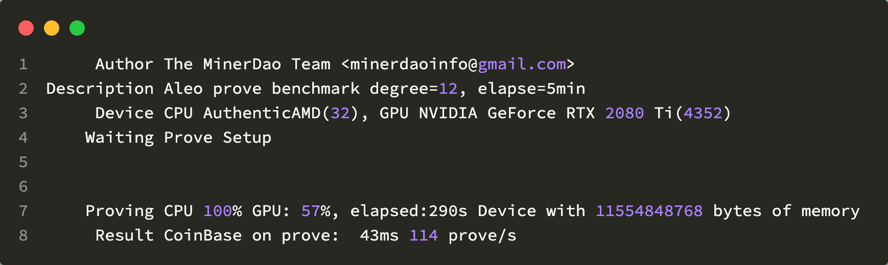

# Aleo Prove bench

## Aleo Prove显卡测试工具



## 功能

- 显示系统设备CPU、GPU信息；
- 显示证明时系统CPU、GPU占用率；
- 支持配置证明时的多项式系数阶degree及最大阶max_degree；

## 支持系统

- Linux
- MacOS
- Windows

## 依赖

- Rust version > 1.58
- cuda version > 11.2

## 编译

```bash
cd aleo-prove-bench

git submodule update

cargo build --release
```

## 用法

```bash
cd aleo-prove-bench/target/release/

aleoprove [degree] [max_degreee]
```

## 结果

```sh
Device: CPU 名字(核数), GPU 名字(核数)[V驱动版本]
Proving: 100%, CPU 0%, Mem 79%, GPU 90%, GpuMem 3% 
Time: 7431ms/每个prove, n个prove/s
```
